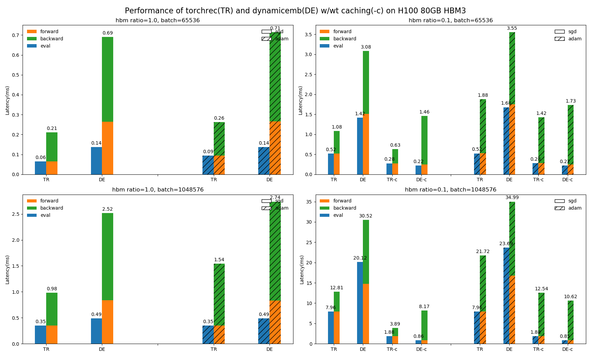

# Dynamic Embedding Benchmark

## Overview

This folder contains benchmarks about dynamicemb.

## 1.Benchmark EmbeddingCollection

In this benchmark, we provide a simple performance test for dynamic embedding using 8 GPUs. The test utilizes the embedding table from DLRM and performs embedding table fusion to create a large embedding table, followed by lookups for 26 features.

### How to run

```bash
bash ./benchmark/benchmark_embedding_collection.sh <use_index_dedup> <use_dynamic_embedding> <batch_size>
```

#### Parameters

- `<use_index_dedup>`: A boolean flag to enable or disable index deduplication before data distribution.
  - **True**: Enables index deduplication, reducing communication overhead.
  - **False**: Disables index deduplication.
  - **Default**: True.

- `<use_dynamic_embedding>`: A boolean flag to enable or disable the use of dynamic embedding tables.
  - **True**: Enables dynamic embedding tables.
  - **False**: Uses static embedding tables from TorchREC.
  - **Default**: True.

- `<batch_size>`: The global batch size for processing during the benchmark.
  - **Default**: 65536.

### Test Results

In this benchmark, we primarily focus on the performance of embedding collection and deduplication. The tests were conducted on a single node with 8 H100 GPUs connected via NVSwitch. Below are the performance results:

| Configuration               | TorchREC Raw Table (ms) | Dynamic Embedding Table (ms) |
|-----------------------------|-------------------------|-------------------------------|
| Open Dedup, Batch Size 65536 | 14.88                   | 21.56                         |
| Close Dedup, Batch Size 65536 | 23.99                   | 28.47                         |

These results indicate the time taken to perform the embedding collection and deduplication operations under the specified configuration.

During the embedding lookup process, dynamic embedding incurs some performance overhead compared to TorchREC's raw table. However, these overheads diminish when considered within the context of the entire end-to-end model.

## 2.Benchmark BatchedDynamicEmbeddingTables

In this benchmark, we test the forward and backward overhead of `BatchedDynamicEmbeddingTables` (torch.nn.Module contains batched embedding tables) on a single GPU.

### How to run

```bash
bash ./benchmark/benchmark_batched_dynamicemb_tables.sh
```

### Test Results

We test the `BatchedDynamicEmbeddingTables` under different capacities with the same HBM consumption for embeddings, leading to different HBM proportion.

The overhead(ms) on H100 80GB HBM3, used pow-law(alpha=1.05) as input.
- embedding_dtype: float32
- embedding_dim: 128
- cache_algorithm: lru
- num_iterations: 100
- num_embeddings: 8M for hbm_ration=1, 64M for hbm_ratio=0.125


