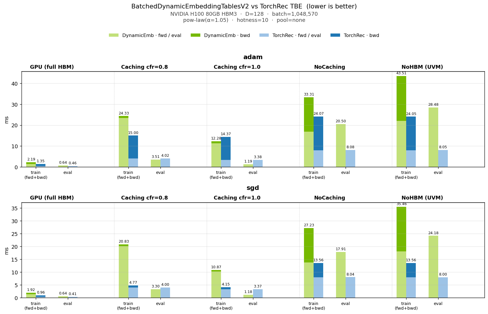
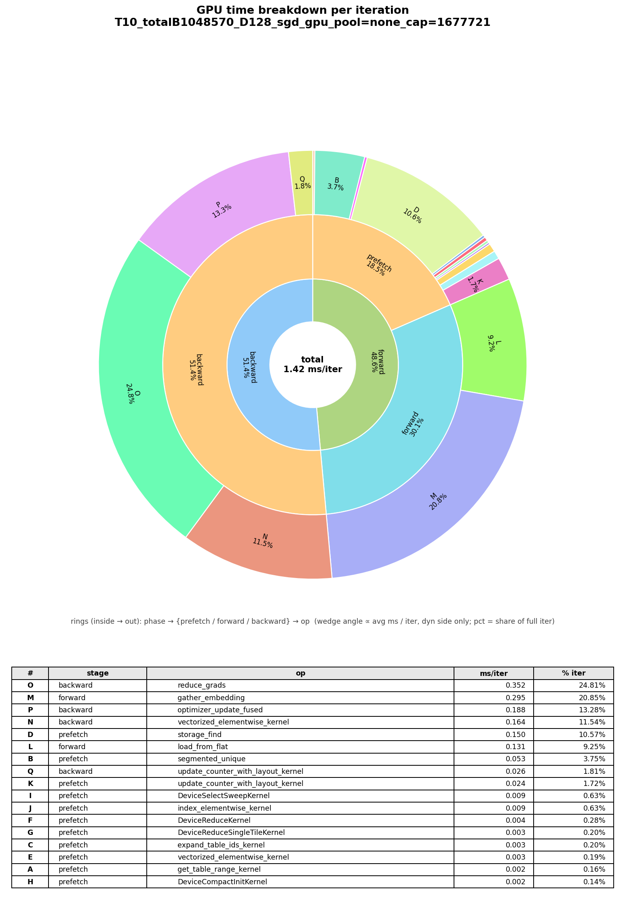
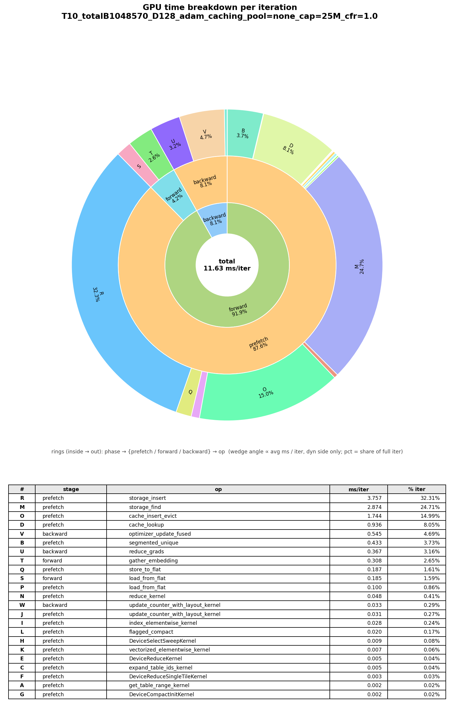

# Dynamic Embedding Benchmark

## Overview

This folder contains benchmarks about dynamicemb.

## 1.Benchmark EmbeddingCollection

In this benchmark, we provide a simple performance test for dynamic embedding using 8 GPUs. The test utilizes the embedding table from DLRM and performs embedding table fusion to create a large embedding table, followed by lookups for 26 features.

### How to run

```bash
bash ./benchmark/benchmark_embedding_collection.sh <use_index_dedup> <use_dynamic_embedding> <batch_size>
```

#### Parameters

- `<use_index_dedup>`: A boolean flag to enable or disable index deduplication before data distribution.
  - **True**: Enables index deduplication, reducing communication overhead.
  - **False**: Disables index deduplication.
  - **Default**: True.

- `<use_dynamic_embedding>`: A boolean flag to enable or disable the use of dynamic embedding tables.
  - **True**: Enables dynamic embedding tables.
  - **False**: Uses static embedding tables from TorchREC.
  - **Default**: True.

- `<batch_size>`: The global batch size for processing during the benchmark.
  - **Default**: 65536.

### Test Results

In this benchmark, we primarily focus on the performance of embedding collection and deduplication. The tests were conducted on a single node with 8 H100 GPUs connected via NVSwitch. Below are the performance results:

| Configuration               | TorchREC Raw Table (ms) | Dynamic Embedding Table (ms) |
|-----------------------------|-------------------------|-------------------------------|
| Open Dedup, Batch Size 65536 | 14.88                   | 21.56                         |
| Close Dedup, Batch Size 65536 | 23.99                   | 28.47                         |

These results indicate the time taken to perform the embedding collection and deduplication operations under the specified configuration.

During the embedding lookup process, dynamic embedding incurs some performance overhead compared to TorchREC's raw table. However, these overheads diminish when considered within the context of the entire end-to-end model.

## 2.Benchmark BatchedDynamicEmbeddingTables

This benchmark measures forward / backward / evaluation overhead of
`BatchedDynamicEmbeddingTablesV2` against the TorchRec/FBGEMM
`SplitTableBatchedEmbeddingBagsCodegen` baseline on a single GPU.

It is structured as a pytest suite (`benchmark_batched_dynamicemb_tables.py`)
wrapped by a thin shell launcher (`benchmark_batched_dynamicemb_tables.sh`).
All extra flags after the shell script are forwarded to pytest, so you can
use pytest's `-k`, `-x`, `--co`, etc. to select / inspect tests.

### Test suites

Four suites parametrize over `(batch_size, num_tables, optimizer, pooling_mode)`
plus `cache_footprint_ratio` for `TestCaching`.  Defaults: `num_tables=10`
with per-table cap = `_GPU_TOTAL_CAP // nt` (`TestGpu`) or
`_CACHE_TOTAL_CAP // nt` (everything else), so total HBM stays fixed
as `nt` changes.

| Suite           | gpu_ratio | caching | Notes                              |
| --------------- | --------- | ------- | ---------------------------------- |
| `TestGpu`       | 1.0       | False   | Full table in HBM                  |
| `TestCaching`   | 0.1       | True    | 10% HBM as LRU cache               |
| `TestNoCaching` | 0.1       | False   | 10% HBM in HybridStorage           |
| `TestNoHbm`     | 0.0       | False   | Pure UVM                           |

Default per-config knobs: `num_iterations=100`, `embedding_dim=128`,
`feature_distribution="pow-law"` with `alpha=1.05`, `emb_precision=fp32`,
Adam (or SGD) with `learning_rate=0.1`, `eps=1e-8`.

### Run everything

```bash
bash ./benchmark/benchmark_batched_dynamicemb_tables.sh
```

Output goes to stdout and a per-config JSON entry is appended to
`benchmark_results.json` (override via `BENCHMARK_RESULTS_FILE=...`).

### Run a subset

The shell script forwards `"$@"` to pytest, so any pytest selector works:

```bash
# Only the full-HBM suite
bash ./benchmark/benchmark_batched_dynamicemb_tables.sh -k TestGpu

# Only Adam configs (any suite)
bash ./benchmark/benchmark_batched_dynamicemb_tables.sh -k adam

# Combine
bash ./benchmark/benchmark_batched_dynamicemb_tables.sh -k "TestCaching and adam"

# List configs without running anything
bash ./benchmark/benchmark_batched_dynamicemb_tables.sh --co
```

Config labels look like
`T10_totalB1048570_D128_adam_caching_pool=none_cap=25M_cfr=1.0`
(`T<num_tables>_totalB<total_batch>_..._cap=<per-table>M`; uniform
per-table caps collapse to a single `cap=<N>M` token); you can match
any substring of that with `-k`.

### Correctness mode

Correctness mode compares the per-iter forward output of DynamicEmb
against the TorchRec/FBGEMM TBE baseline.  It:

1. Restricts the sparse-feature sampler to `[0, cap/2)` for each table.
2. Mirrors TorchRec's `[0, cap/2)` weight slice into DynamicEmb so every
   lookup hits a key with identical initial values on both backends.
3. Runs the timing loop (`benchmark_train_eval`) with `check_forward=True`
   so every train / eval iter asserts `torch.allclose` with a
   precision-aware tolerance (`atol=1e-4, rtol=1e-3` for fp32).

Two ways to enable it:

```bash
# CLI override: force-enable on every parametrized config
bash ./benchmark/benchmark_batched_dynamicemb_tables.sh --correctness

# Per-config: set `correctness=True` on the BenchmarkConfig in
# _gpu_configs / _caching_configs / etc.
```

Correctness is automatically disabled (with a `UserWarning`) when any
`--profile` mode is set, because profiling captures workloads rather than
validating them.

### Nsight Systems (nsys) profiling

`--profile nsys` switches the run to a dedicated nsys-friendly path:
`run_reporting_loop` runs as untimed warmup, then `benchmark_with_nsys`
wraps the actual sampled iterations in a `cudaProfilerStart` /
`cudaProfilerStop` window.  The benchmark itself only annotates NVTX
ranges; the actual capture happens externally via `nsys profile`.

`benchmark_with_nsys` emits **one Start/Stop window per config**.  We
always use `--capture-range-end=repeat-shutdown:N` (with `N >=` the
number of configs) so nsys records every window it sees -- with `-k
<label>` that's a single window, without filter it's the full suite.
Setup / reporting-loop warmup / between-config gaps stay out of the
recording in both modes.

**Note on the `:N`.** Older nsys releases (including the one on the
cluster's `distributed-recommender` container) reject bare
`repeat-shutdown` and require an explicit cycle count.  Bare `repeat`
is accepted, but its default behavior is a *sampled* capture -- in
practice it keeps only a few cycles when many fire in sequence, so
some configs silently end up missing from the trace.  Always pass an
explicit `:N` and size it to the number of `cudaProfilerStart` calls
your script will issue (10 for the full benchmark suite; use a larger
N like 20 if unsure).

**Single config** -- pick one config with `-k <label>`:

```bash
nsys profile \
    --output=trace_dyn \
    --force-overwrite=true \
    --sample=none \
    --cpuctxsw=none \
    --trace=cuda,nvtx,osrt,mpi,ucx \
    --cuda-graph-trace=node \
    --cuda-flush-interval=100 \
    --capture-range=cudaProfilerApi \
    --capture-range-end=repeat-shutdown:10 \
    --target-processes=all \
    bash ./benchmark/benchmark_batched_dynamicemb_tables.sh \
        --profile nsys -k "TestGpu and adam"
```

**Multi config** -- whole suite into one trace:

```bash
nsys profile \
    --output=trace_all \
    --force-overwrite=true \
    --sample=none \
    --cpuctxsw=none \
    --trace=cuda,nvtx,osrt,mpi,ucx \
    --cuda-graph-trace=node \
    --cuda-flush-interval=100 \
    --capture-range=cudaProfilerApi \
    --capture-range-end=repeat-shutdown:10 \
    --target-processes=all \
    bash ./benchmark/benchmark_batched_dynamicemb_tables.sh --profile nsys
```

Flag breakdown (shared by both invocations):

| Flag | Meaning |
| --- | --- |
| `--sample=none` | disable periodic CPU stack sampling -- cuts overhead and trace size when only GPU/NVTX is needed |
| `--cpuctxsw=none` | drop OS context-switch records -- noisy on multi-core, rarely needed for kernel-level perf |
| `--trace=cuda,nvtx,osrt,mpi,ucx` | trace CUDA API + GPU work, NVTX markers, OS-runtime syscalls, MPI calls, UCX calls (the latter two are no-ops on single-node single-GPU and can be dropped) |
| `--cuda-graph-trace=node` | expand CUDA Graph launches into per-node events so kernels inside a captured graph stay individually visible |
| `--cuda-flush-interval=100` | flush the CUDA event buffer every 100 ms so long runs don't overflow the ring buffer and drop events |
| `--capture-range=cudaProfilerApi` | start recording only when the process calls `cudaProfilerStart` (skips table/data setup and the reporting-loop warmup) |
| `--capture-range-end=repeat-shutdown:N` | record up to `N` Start/Stop windows into the same trace (skip gaps in between), end the session at process shutdown.  Set `N` ≥ number of `cudaProfilerStart` calls -- e.g. `:10` for the full suite.  Bare `repeat-shutdown` is rejected on older nsys; bare `repeat` is accepted but silently drops cycles when many fire back-to-back |
| `--target-processes=all` | follow children/forks too -- needed because `torchrun` spawns a worker process to host pytest |
| `--force-overwrite=true` | overwrite an existing output file instead of erroring out |
| `--output=<name>` | output file (`.nsys-rep` is the current extension; `.qdrep` from older releases still works) |

NVTX layout inside each window:
```
<cfg.label()>                          # e.g. T10_totalB1048570_D128_adam_gpu_...
└─ nsys_iter_0                         # per-iter
   ├─ dyn → forward / backward
   └─ trc → forward / backward
└─ nsys_iter_1
└─ ...
```

Browse the trace with `nsys-ui` (locally) or summarize on the cluster:

```bash
# pick a kernel-time top-N across all configs
nsys stats --report cuda_gpu_kern_sum trace_all.nsys-rep | head -30

# group kernel time by NVTX range (= cfg.label()) to compare configs
nsys stats --report cuda_gpu_kern_gb_sum trace_all.nsys-rep | head -30
```

#### Per-op breakdown pipeline (`.nsys-rep` → sunburst PNG)

End-to-end pipeline that reduces each config's nsys trace into a CSV of
per-op GPU time and renders it as a sunburst chart.  Tools:
`nsys_breakdown.py` (trace → CSV) and `nsys_sunburst.py` (CSV → PNG).

**Op attribution.**  `batched_dynamicemb_function.py` wraps the
embedding-side hot path in `torch.cuda.nvtx.range("op:<name>")` markers
(13 ops: `cache_lookup`, `storage_find`, `gather_embedding`,
`reduce_grads`, `optimizer_update_fused`, ...).  Each launch falls into
the innermost `op:*` range active on the CPU side at launch time
(CUPTI_ACTIVITY_KIND_RUNTIME — *not* GPU exec time, which would miss
async backward kernels).  Launches with no `op:*` parent above them
are kept individually under their kernel name so they remain visible
in the chart.

**Step 1 — capture one `.nsys-rep` per config.**  The recommended
approach is one `nsys profile` invocation per config (one
`--capture-range-end=stop` window per process).  This sidesteps a
buffer-rotation bug in older nsys releases that silently drops cycles
when many `repeat`/`repeat-shutdown:N` windows fire back-to-back in a
single process.  On the cluster, drive it from a loop like:

```bash
# pseudocode — see run_nsys_loop.sbatch for the working version
for TEST_ID in $(pytest --collect-only -q ...); do
    LABEL=$(echo "$TEST_ID" | sed -E 's/.*\[(.+)\]$/\1/')
    nsys profile \
        --output=nsys_run/trace_${LABEL} \
        --sample=none --cpuctxsw=none \
        --trace=cuda,nvtx,osrt --cuda-graph-trace=node \
        --capture-range=cudaProfilerApi \
        --capture-range-end=stop \
        torchrun --nnodes 1 --nproc_per_node 1 \
            -m pytest -svv --profile nsys "$TEST_ID"
done
```

After the loop you have one `trace_<NN>_<cfg-label>.nsys-rep` per
config.

**Step 2 — `nsys_breakdown.py`: trace → per-config CSV.**  Exports
each `.nsys-rep` to a sqlite via `nsys export`, then joins
`CUPTI_ACTIVITY_KIND_RUNTIME` (CPU launch times) with
`CUPTI_ACTIVITY_KIND_KERNEL` (GPU exec times) and `NVTX_EVENTS` to
attribute every kernel to the innermost `op:*` range live at launch:

```bash
python nsys_breakdown.py nsys_run/*.nsys-rep --out-dir nsys_run/
# -> nsys_run/opcalls__<cfg-label>.csv  (one CSV per .nsys-rep)
```

Each CSV row is one op (or one bare kernel) with columns:
`phase,parent_stages,op,calls_per_iter,avg_ms_per_iter,total_ms,num_iters,kernel_names,fallback_category`.

**Step 3 — `nsys_sunburst.py`: CSV → PNG.**  Renders a 3-ring
sunburst per CSV (phase / stage / op) with a legend table listing
letter codes, op names, and percentage of total iteration time:

```bash
python nsys_sunburst.py nsys_run/opcalls__*.csv
# -> nsys_run/opcalls__<cfg-label>.sunburst.png  (next to each CSV)
```

The PNG drops next to its CSV by default; pass paths individually to
control output location.  Example outputs live under
[`plots/breakdown_sgd_gpu.png`](./plots/breakdown_sgd_gpu.png) and
[`plots/breakdown_adam_caching_cfr1.0.png`](./plots/breakdown_adam_caching_cfr1.0.png).

Working artifacts (`.nsys-rep`, `.sqlite`, intermediate CSV/PNG) are
expected to land under `local/` (gitignored).  Only the curated
figures committed under `plots/` are tracked.

### Nsight Compute (ncu) profiling

`--profile ncu` profiles per-kernel hardware counters (unlike nsys, which is a
timeline).  It is a two-step workflow:

1. **`--profile ncu-gen`** prints the exact `ncu` command for a config (single-
   config and whole-suite variants) and exits without running anything.  This
   is the source of truth for the literal command.  Optionally pass
   `--ncu-kernel-regex` to name the kernel(s) to profile (emitted verbatim as
   `--kernel-name 'regex:<value>'`); omit it to profile **every** kernel within
   the `--nvtx-include` scope (e.g. all kernels of an op range).
2. **`--profile ncu`** is the inner workload the printed command wraps: it warms
   up via the reporting loop, runs every iteration inside a single
   `cudaProfilerStart/Stop` window (outer NVTX range `cfg.label()`, inner range
   `ncu_iter`, per-iter range `iter_{i}`), and **by default only iteration 0 is
   actually captured** -- the printed command's `--nvtx-include` scopes it.  Use
   `--ncu-iterations` to widen.

So you generate the command, then run it:

```bash
# Step 1 — print the command for one TestGpu config.  -k takes any pytest
# expression matched against the test id (class + cfg.label()); the concise
# "TestGpu and adam" uniquely selects the adam config today.  --ncu-kernel-regex
# is optional (omit to profile all kernels in the nvtx scope).  ncu-gen prints a
# command whose inner -k is the exact, lossless label.
bash ./benchmark/benchmark_batched_dynamicemb_tables.sh \
    --profile ncu-gen -k "TestGpu and adam" \
    --ncu-kernel-regex 'segmented_unique|table_insert'

# Step 2 — run the printed command (shape shown here; ncu-gen emits the exact
# -k label and your --ncu-kernel-regex verbatim):
ncu -f --target-processes all \
    --profile-from-start off \
    --nvtx --nvtx-include 'ncu_iter/iter_0/' \
    --kernel-name 'regex:segmented_unique|table_insert' \
    --set full \
    --import-source=yes \
    --csv --page raw \
    -o ncu_T10_totalB1048570_D128_adam_gpu_pool=none_cap=1M \
    bash ./benchmark/benchmark_batched_dynamicemb_tables.sh \
        --profile ncu -k 'T10_totalB1048570_D128_adam_gpu_pool=none_cap=1M'
```

To profile **all** TestGpu configs (currently `adam` + `sgd`) into one report,
drop the exact label and select the class: `-k TestGpu` on both the `ncu-gen`
and the wrapped `--profile ncu` invocation; the outer `cfg.label()` NVTX range
attributes kernels per config.

| ncu flag | why |
| -------- | --- |
| `--target-processes all` | ncu launches `bash`, which `torchrun`-spawns the python worker that runs the CUDA kernels; without this ncu would only watch the kernel-less `bash`. |
| `--profile-from-start off` | gate profiling to the `cudaProfilerStart/Stop` window (skips table build + warmup).  Must stay paired with `cudaProfilerStart` -- dropping the call profiles nothing. |
| `--nvtx --nvtx-include 'ncu_iter/iter_0/'` | belt-and-suspenders NVTX-range gate, and the iteration selector: only kernels under the listed `iter_{i}` ranges are profiled (default `iter_0`; `--ncu-iterations` emits one include per selected iter). |
| `--kernel-name 'regex:...'` | restrict to the kernel(s) named via the optional `--ncu-kernel-regex`; omitted entirely when that flag is not given, so all kernels in the NVTX scope are profiled (e.g. every kernel of an op range like `op:segmented_unique`). |
| `--set full` | full metric set (heaviest; most replay passes). |
| `--import-source=yes` | embed CUDA source so the Source page works offline (relies on `-lineinfo`, which the build now sets). |

`--num-iterations N` overrides `BenchmarkConfig.num_iterations` (default 100) on
every config.  This is the number of sampled batches, so it also bounds the
warmup/reporting loop and how many iterations each profile mode covers.  Lower
it to keep `--profile ncu` tractable (ncu replays every matched kernel launch
with the full metric set), e.g. add `--num-iterations 3` to the wrapped
`--profile ncu` invocation.

`--ncu-iterations` (only with `--profile ncu`) selects *which* iterations ncu
captures, widening the default of iteration 0 only.  It accepts either a comma
list or a Python-style `begin:end:step` slice (end exclusive; parts optional):

```bash
--ncu-iterations 0,3,7      # capture iterations 0, 3, 7
--ncu-iterations ::2        # every other iteration
--ncu-iterations 2:20:3     # 2,5,8,11,... (clamped to num_iterations)
--ncu-iterations 90:        # the last iterations of a 100-iter run
```

The selection is applied in the **ncu command**, not the workload: a single
`cudaProfilerStart/Stop` pair still wraps the whole run (ncu reliably honors
only one window), and `ncu-gen` turns the selection into one
`--nvtx-include 'ncu_iter/iter_{i}/'` per selected iteration (OR-ed together).
Unselected iterations still run (to advance the table / keep the cache warm)
but their kernels are filtered out by NVTX.  This differs from
`--num-iterations`: that shrinks the *total* iteration count (and warmup);
`--ncu-iterations` keeps the full run but only profiles a subset -- the right
tool when you need a warmed, steady-state iteration rather than the first few.
Pass it to `ncu-gen` so the printed command carries the right `--nvtx-include`
filters.

#### Capturing all kernels of an op range

A single dynamicemb op launches several **differently-named** kernels
(`segmented_unique` runs `expand_table_ids`, `segmented_init`,
`segmented_unique_kernel`, two `cub::DeviceScan*`, `compact_keys_and_freq`,
`adjust_output_indices`, plus a couple of torch fill kernels).  A
`--kernel-name` regex can only match one name, so to profile the **whole op**
you scope by its NVTX range instead and drop the kernel-name filter.

The prefetch/forward path wraps each op in an `op:<name>` NVTX range (e.g.
`op:segmented_unique`, `op:cache_lookup`, `op:gather_embedding`,
`op:reduce_grads`, `op:store_to_flat`, ...).  Their nesting inside a profiled
iteration is:

```
ncu_iter / iter_0 / forward / dynamicemb_prefetch / op:segmented_unique / <kernels>
```

To capture every kernel of `op:segmented_unique` in iteration 0, point
`--nvtx-include` at that nested path and omit `--ncu-kernel-regex` (so no
`--kernel-name` filter is emitted):

```bash
ncu -f --target-processes all --profile-from-start off \
    --nvtx --nvtx-include 'ncu_iter/iter_0/forward/dynamicemb_prefetch/op:segmented_unique/' \
    --set full --import-source=yes --csv --page raw \
    -o ncu_sgd_segunique_all \
    bash ./benchmark/benchmark_batched_dynamicemb_tables.sh --profile ncu -k "TestGpu and sgd"
```

The trailing `/` includes the whole subtree, so all kernels launched inside the
range are profiled regardless of name.  (Anchoring on just `op:segmented_unique/`
would match the op in *every* iteration; the `ncu_iter/iter_0/.../` prefix pins
it to iteration 0.  If the intermediate nesting changes, replace the middle
levels with wildcards: `ncu_iter/iter_0/*/*/op:segmented_unique/`.)

Other profile modes:

| `--profile` value | What it does                                                          |
| ----------------- | --------------------------------------------------------------------- |
| (omitted)         | Normal timing path; reports avg fwd/bwd/train/eval (ms) per config.    |
| `torch`           | Runs each backend under `torch.profiler`; exports Chrome trace + bandwidth report. |
| `nsys`            | NVTX-annotated profile path described above.                          |
| `ncu-gen`         | Prints the matching `ncu` command for the config and exits.           |
| `ncu`             | Warms up via the reporting loop, runs all iterations inside one `cudaProfilerStart/Stop` window, and captures iteration 0 by default (widen with `--ncu-iterations`). |

### Cache footprint sizing (TestCaching)

`TestCaching` is parametrized by `cache_footprint_ratio` (currently
`[0.8, 1.0]`).  At runtime the harness:

1. Generates the full sparse-feature stream before any table is built.
2. Counts distinct keys touched per table across all iterations -- the
   workload's true HBM footprint.
3. Resizes the cache so it holds
   `footprint × cache_footprint_ratio` rows per table
   (DynamicEmb `local_hbm_for_values`, FBGEMM `cache_load_factor`).

This means TestCaching emits one config per ratio in the suite, with
labels like `..._caching_..._cfr=0.8` / `..._cfr=1.0`.  The other three
suites (`TestGpu`, `TestNoCaching`, `TestNoHbm`) leave
`cache_footprint_ratio=None` and keep their construction-time
`hbm_for_embeddings` / `gpu_ratio`.

Cache state from the warmup (`run_reporting_loop`) is **kept** for the
subsequent timed `benchmark_train_eval` — only the hit-rate recorder is
disabled.  The timed numbers therefore measure steady-state cache
behavior, not a cold start.

### Plotting results

`benchmark_results.json` produced above is visualized with
`plot_benchmark_results.py`.  The script writes a single figure
(`benchmark_bdet_plot.png`) into the output directory (default
`./plots/`).  The caching column auto-fans-out into one panel per
`cache_footprint_ratio` present in the JSON, so cfr=0.8 and cfr=1.0 sit
side-by-side in the same image (the figure width scales with column
count).

```bash
# Main figure into ./plots/benchmark_bdet_plot.png
python plot_benchmark_results.py

# Different output directory / results file
python plot_benchmark_results.py \
    --results /path/to/results.json \
    --out-dir /tmp/bdet_plots

# Log y-axis (one suite dominates the range)
python plot_benchmark_results.py --log

# Hide bar value labels
python plot_benchmark_results.py --no-values
```

Each figure carries a two-line subtitle auto-derived from the result
dict:

```
NVIDIA H100 80GB HBM3  ·  D=128  ·  batch=1,048,570
pow-law(α=1.05)  ·  hotness=10  ·  pool=none
```

`cache_footprint_ratio` is intentionally not in the subtitle — it shows
up in the per-panel headers on the top secondary x-axis instead
(`Caching cfr=0.8`, `Caching cfr=1.0`).
Fields populated by `run_single_benchmark`: `gpu_name`, `embedding_dim`,
`batch_size`/`num_tables`, `feature_distribution`, `alpha`, `max_hotness`,
`pooling_mode`, `cache_footprint_ratio`.  Any field missing from a legacy
JSON is silently skipped.

Layout: one row per optimizer; within each row, every panel (`GPU`,
one per caching ratio, `NoCaching`, `NoHBM`) is drawn side-by-side on a
**shared y-axis**.  Panel names sit on a secondary axis at the top,
train/eval labels under the bars, dotted separators between panel
regions.  Each panel shows a stacked `train (fwd + bwd)` bar plus a
separate `eval` bar for DynamicEmb vs TorchRec.  Because modes span
~0.5 ms (GPU) to ~40 ms (NoHBM), GPU bars look small under the shared
scale — pass `--log` to expand the low end.

### Test Results

The figures below were collected on **NVIDIA H100 80GB HBM3** (single GPU)
with `pow-law(alpha=1.05)` index distribution.

Run configuration:
- hardware: NVIDIA H100 80GB HBM3 (single GPU)
- embedding_dtype: float32
- embedding_dim: 128
- num_tables: 10 (per-table batch = total / 10 = 104,857; total batch = 1,048,570)
- cache_algorithm: lru
- gpu_ratio: 1.0 (`TestGpu`) / footprint × `cache_footprint_ratio`
  (`TestCaching`) / 0.1 (`TestNoCaching`) / 0.0 (`TestNoHbm`)
- per-table capacity: 1.6M (`TestGpu`, `_GPU_TOTAL_CAP // nt` = 16M / 10, sized so DynamicEmb + TorchRec TBE both fit in 80 GB), 25.6M otherwise (`_CACHE_TOTAL_CAP // nt` = 256M / 10)
- optimizers: adam (`eps=1e-8`) and sgd
- num_iterations: 100

Latency by suite (DynamicEmb vs TorchRec TBE, lower is better):



#### Per-op breakdown (DynamicEmb side)

Two representative configs profiled via `nsys` and reduced with
`nsys_breakdown.py` + `nsys_sunburst.py` (see [nsys profiling](#nsight-systems-nsys-profiling)).
The sunburst rings are: phase (forward / backward) → stage
(prefetch / forward / backward) → op (NVTX `op:*` range, or kernel name
when no wrapper is present).  Percentages are share of the full
iteration time; letter codes index the legend table below each chart.

`sgd + GPU (full HBM)` — 1.59 ms/iter; cost dominated by
`segmented_unique` (~24%), `gather_embedding` (~19%), and
`optimizer_update_fused` (~12%):



`adam + Caching cfr=1.0` — 11.63 ms/iter; cache traffic dominates:
`storage_insert` (~32%), `storage_find` (~25%), `cache_insert_evict`
(~15%), `cache_lookup` (~8%), with the Adam update (`optimizer_update_fused`)
only ~5%:


