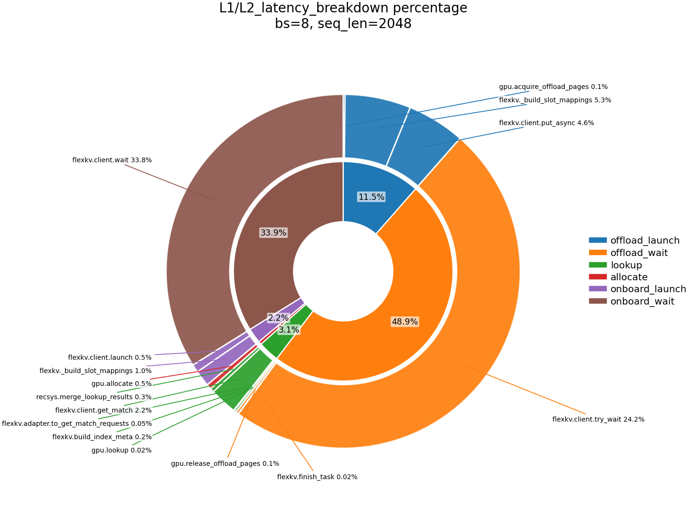

# Recsys FlexKVCache Manager — CPU Breakdown Analysis


## Test Environment
 GPU : **NVIDIA H100** 

## Micro-bench 1: 3-Step Pipeline + Two-Level Breakdown

### 1.1 Configuration

| Parameter | Value |
| --------- | ----- |
| `num_layers` | **8** |
| `head_dim` | **256** |
| `num_heads` | **4** |
| `batch_size` | **8** |
| `len_per_seq` / `sequence_length` | **1024 / 2048 / 4096** |
| `dtype` | **bf16** |


```text
[Step1: offload round (new sequence, no cache)] input (seq_len x batch_size) → lookup → allocate(+gpu.put) → offload_launch(+put_async) → offload_wait
[Step2] evict_gpu
[Step3: onboard round (100% GPU miss, 100% CPU hit)] input (the same, seq_len x batch_size) → lookup → allocate → onboard_launch → onboard_wait
```

### 1.2 L1/L2 latency breakdown

<table>
  <thead>
    <tr>
      <th rowspan="2">step</th>
      <th colspan="4">L1 (step-op)</th>
      <th colspan="4">L2 (function)</th>
    </tr>
    <tr>
      <th>op</th>
      <th>1024</th>
      <th>2048</th>
      <th>4096</th>
      <th>function</th>
      <th>1024</th>
      <th>2048</th>
      <th>4096</th>
    </tr>
  </thead>
  <tbody>
    <tr>
      <td rowspan="12">offload round (new sequence, no cache)</td>
      <td rowspan="5">lookup</td>
      <td rowspan="5">2.834</td>
      <td rowspan="5">3.523</td>
      <td rowspan="5">3.642</td>
      <td><code>recsys.gpu.lookup</code></td>
      <td>0.088</td>
      <td>0.135</td>
      <td>0.143</td>
    </tr>
    <tr>
      <td><code>recsys.host.build_index_meta</code></td>
      <td>0.302</td>
      <td>0.428</td>
      <td>0.493</td>
    </tr>
    <tr>
      <td><code>recsys.host.adapter.to_get_match_requests</code></td>
      <td>0.055</td>
      <td>0.090</td>
      <td>0.078</td>
    </tr>
    <tr>
      <td><code>flexkv.client.get_match</code></td>
      <td>1.779</td>
      <td>2.214</td>
      <td>2.257</td>
    </tr>
    <tr>
      <td><code>recsys.merge_lookup_results</code></td>
      <td>0.266</td>
      <td>0.247</td>
      <td>0.258</td>
    </tr>
    <tr>
      <td>allocate</td>
      <td>0.839</td>
      <td>1.140</td>
      <td>1.153</td>
      <td><code>recsys.gpu.allocate</code></td>
      <td>0.825</td>
      <td>1.126</td>
      <td>1.140</td>
    </tr>
    <tr>
      <td rowspan="3">offload_launch</td>
      <td rowspan="3">6.682</td>
      <td rowspan="3">7.192</td>
      <td rowspan="3">7.948</td>
      <td><code>recsys.gpu.acquire_offload_pages</code></td>
      <td>0.098</td>
      <td>0.093</td>
      <td>0.102</td>
    </tr>
    <tr>
      <td><code>recsys.host._build_slot_mappings</code></td>
      <td>3.329</td>
      <td>3.303</td>
      <td>3.790</td>
    </tr>
    <tr>
      <td><code>flexkv.client.put_async</code></td>
      <td>2.529</td>
      <td>2.911</td>
      <td>3.192</td>
    </tr>
    <tr>
      <td rowspan="3"><strong>offload_wait</strong></td>
      <td rowspan="3"><strong>25.514</strong></td>
      <td rowspan="3"><strong>30.655</strong></td>
      <td rowspan="3"><strong>39.922</strong></td>
      <td><code>recsys.host.offload_wait</code> (multiple <code>client.try_wait</code>)</td>
      <td>13.082</td>
      <td>15.180</td>
      <td>18.577</td>
    </tr>
    <tr>
      <td><code>recsys.host.finish_task</code></td>
      <td>0.010</td>
      <td>0.010</td>
      <td>0.011</td>
    </tr>
    <tr>
      <td><code>recsys.gpu.release_offload_pages</code></td>
      <td>0.058</td>
      <td>0.074</td>
      <td>0.061</td>
    </tr>
    <tr>
      <td rowspan="9">onboard round (100% GPU miss, 100% CPU hit)</td>
      <td rowspan="5">lookup</td>
      <td rowspan="5">1.830</td>
      <td rowspan="5">1.951</td>
      <td rowspan="5">1.997</td>
      <td><code>recsys.gpu.lookup</code></td>
      <td>0.016</td>
      <td>0.014</td>
      <td>0.014</td>
    </tr>
    <tr>
      <td><code>recsys.host.build_index_meta</code></td>
      <td>0.090</td>
      <td>0.106</td>
      <td>0.105</td>
    </tr>
    <tr>
      <td><code>recsys.host.adapter.to_get_match_requests</code></td>
      <td>0.031</td>
      <td>0.031</td>
      <td>0.029</td>
    </tr>
    <tr>
      <td><code>flexkv.client.get_match</code></td>
      <td>1.260</td>
      <td>1.380</td>
      <td>1.418</td>
    </tr>
    <tr>
      <td><code>recsys.merge_lookup_results</code></td>
      <td>0.201</td>
      <td>0.200</td>
      <td>0.202</td>
    </tr>
    <tr>
      <td>allocate</td>
      <td>0.275</td>
      <td>0.292</td>
      <td>0.288</td>
      <td><code>recsys.gpu.allocate</code></td>
      <td>0.267</td>
      <td>0.285</td>
      <td>0.281</td>
    </tr>
    <tr>
      <td rowspan="2">onboard_launch</td>
      <td rowspan="2">1.306</td>
      <td rowspan="2">1.380</td>
      <td rowspan="2">1.424</td>
      <td><code>recsys.host._build_slot_mappings</code></td>
      <td>0.630</td>
      <td>0.623</td>
      <td>0.615</td>
    </tr>
    <tr>
      <td><code>flexkv.client.launch</code></td>
      <td>0.259</td>
      <td>0.311</td>
      <td>0.324</td>
    </tr>
    <tr>
      <td><strong>onboard_wait</strong></td>
      <td><strong>17.341</strong></td>
      <td><strong>21.244</strong></td>
      <td><strong>37.272</strong></td>
      <td><code>flexkv.client.wait</code></td>
      <td>17.270</td>
      <td>21.180</td>
      <td>37.143</td>
    </tr>
  </tbody>
</table>

### 1.3 L1/L2 latency breakdown percentage (`seq_len=2048`)

Inner ring: **L1** step-ops (lookup, allocate, onboard launch, onboard wait, offload launch, offload wait).
Outer ring: **L2** functions nested within the corresponding L1 sector.

<p align="center">
  
</p>


### 1.4 Conclusion

- **Transfer-related latency (~80–87%)** of the measured KV-cache pipeline latency
- **Remaining (~13–19%)**:
  - metadata and fixed orchestration overhead
  - lookup, allocation, offload/onboard launch
  - wrapper/runtime bookkeeping
- **Scalability over `seq_len`:** as sequence length increases, transfer wait remains the dominant component while fixed metadata/orchestration costs become relatively smaller, so the pipeline scales primarily with transfer volume and bandwidth overlap.

---

## Micro-bench 2: Offload Stress Test (`launch x N` + one `offload_try_wait`)

### 2.1 Configuration

| Parameter | Value |
| --------- | ----- |
| `num_layers` | **64** |
| `num_kv_heads` | **8** |
| `head_dim` | **256** |
| dtype | **bf16** |
| `batch_size` | **1** |
| `sequence_length` | **1024** |
| `launch_count` (`N`) | **50 / 100 / 150 / 200 / 250 / 300** |
| peak reference BW (H100 D2H/H2D) | **64 GiB/s** |

### 2.2 Results

| Occupancy (GiB-equivalent) | Effective bandwidth (GiB/s) | Bandwidth utility (%) |
| -------------------------- | ----------------------------- | --------------------- |
| 25 | 16.28 | 25.44% |
| 50 | 25.82 | 40.34% |
| 75 | 29.66 | 46.34% |
| 100 | 37.18 | 58.09% |
| 125 | 39.46 | 61.66% |
| 150 | 41.48 | 64.81% |

### 2.3 Conclusion

- **Small transfer:** dominated by fixed overheads and scheduling costs.
- **Medium/large transfer:** when the request size increases to **1–2 GiB** per burst, the transfer itself becomes the dominant cost, and the H100 D2H/H2D path achieves **~60%+** bandwidth utilization.
- **Offload stress test scaling:**
  - Effective BW increases from **16.28 GiB/s** to **41.48 GiB/s**
  - Effective BW utilization improves from **25.44%** to **64.81%**
