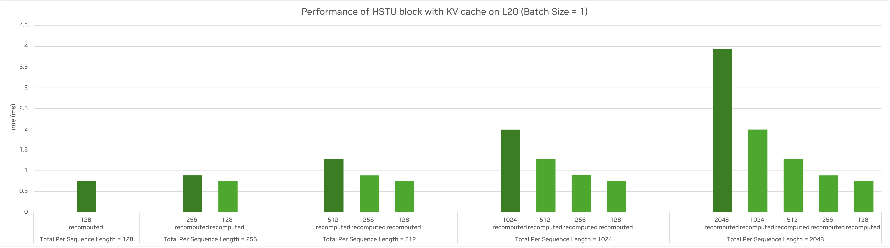
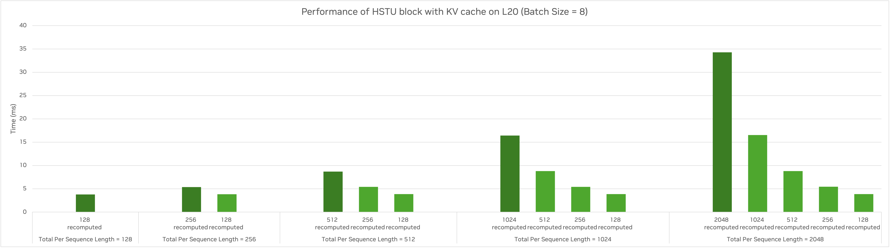

# HSTU Inference Introduction
This is a brief overview of the HSTU inference with KV cache.

## Installation


1. Build TensorRT-LLM (with HSTU KV cache extension):

The HSTU inference utilize customized KV cache manager from TensorRT-LLM.
The current version is based on the HSTU specialized implementation based on TensorRT-LLM v0.19.0.
```bash
~$ cd ${WORKING_DIR}
~$ git clone -b hstu-kvcache-recsys-examples https://github.com/geoffreyQiu/TensorRT-LLM.git tensorrt-llm-kvcache && cd tensorrt-llm-kvcache
~$ git submodule update --init --recursive
~$ make -C docker release_build CUDA_ARCHS="80-real;86-real"
# This will build a docker image with TensorRT-LLM installed.
```

2. Install the dependencies for Recsys-Examples.

Turn on option `INFERENCEBUILD=1` to skip Megatron installation, which is not required for inference.
```bash
~$ cd ${WORKING_DIR}
~$ git clone --recursive -b ${TEST_BRANCH} ${TEST_REPO} recsys-examples && cd recsys-examples
~$ TRTLLM_KVCACHE_IMAGE="tensorrt_llm/release:latest" docker build \
    --build-arg BASE_IMAGE=${TRTLLM_KVCACHE_IMAGE} \
    --build-arg INFERENCEBUILD=1 \
    -t recsys-examples:inference \
    -f docker/Dockerfile .
``` 

3. Try out the showcase or benchmark.

```bash
~$ cd recsys-examples/examples/hstu
~$ export PYTHONPATH=${PYTHONPATH}:$(realpath ../)
~$ python3 ./benchmark/inference_showcase.py
~$ python3 ./benchmark/paged_hstu_with_kvcache_benchmark.py
``` 

## Key Features

1. Cache for KV data

We use GPU memory and host storage for KV data cache., as in `GpuKVCacheManager` and `HostKVStorageManager`. This can help to reduce the recomputation of KV data.

The GPU KV cache is organized as a paged KV-data table, and supports KV data adding/appending, lookup and eviction. When appending new data to the GPU cache, we will evict data from the oldest users according to the LRU policy if there is no empty page. The HSTU attention kernel also accepts KV data from a paged table.

The host KV data storage support adding/appending and lookup. We only present an example implementation, since this can be built over other database and can vary widely in the deployment.

2. Asynchronous H2D transfer of host KV data 

By using asynchronous data copy on the side CUDA stream, we overlap the host-to-device KV data transfer with HSTU computation layer-wise, to reduce the latency of HSTU inference.


3. Optimization with CUDA graph

We utilize the graph capture and replay support in Torch for convenient CUDA graph optimization on the HSTU layers. This decreases the overhead for kernel launch, especially for input with a small batch size. The input data (hidden states) fed to HSTU layers needs paddding to pre-determined batch size and sequence length, due to the requirement of static shape in CUDA graph.


## Benchmark Results

Here we present the benchmark results of the HSTU layers with KV cache on L20 gpus.

HSTU Setup for benchmark:

| Parameter | Value |
|-----------|-------|
| Number of HSTU layers | 8 |
| Hidden Dim Size | 1024 |
| Number of Heads | 4 |
| Head Dim Size | 256 |
| Max Batchsize| 16 |
| Max Per Sequence Length | 4096 |
| Per Sequence Targets Number | 256 |

1. End-to-end inference performance

Here we benchmarked with a synthetic input dataset:
* Each user's input sequence starts from 256 tokens to 4096 in increments of 256.
* Each input request has 256 item candidates for ranking.
* Generate data for 1, 2, 4 and 8 users to benchmark with different batch size. 

We can achieve **1.4x ~ 2.7x** performance speedup for inference (with batch size ranging from 1 to 8), after utilizing the KV cache and CUDA graph optimization.

Performance results:


2. HSTU block performance

Performance Results:




When the input sequence has 2048 tokens in which 1920 tokens have KV data cached, we can achieve **5x ~ 10x** performance speedup on HSTU block (for batch size = 1 and 8 respectively).


