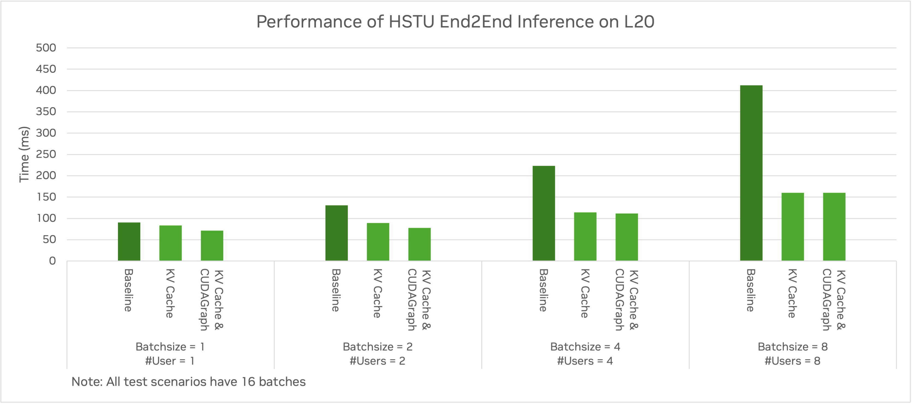

# HSTU Inference benchmark

We provide a set of benchmarks for HSTU Inference on end-to-end inference and paged HSTU inference layer.


## How to run the benchmark

```bash
~$ cd recsys-examples/examples/hstu
~$ export PYTHONPATH=${PYTHONPATH}:$(realpath ../)
~$ python3 ./inference/benchmark/inference_benchmark.py
~$ python3 ./inference/benchmark/paged_hstu_with_kvcache_benchmark.py
```

## Benchmark results

Here we present the benchmark results of the HSTU layers with KV cache on single L20 gpu.

HSTU Setup for benchmark:

| Parameter                   | Value |
| --------------------------- | ----- |
| Number of HSTU layers       | 8     |
| Hidden Dim Size             | 1024  |
| Number of Heads             | 4     |
| Head Dim Size               | 256   |
| Max Batchsize               | 16    |
| Max Per Sequence Length     | 4096  |
| Per Sequence Targets Number | 256   |

### 1. End-to-end inference performance

Here we benchmarked with a synthetic input dataset:

* Each user's input sequence starts from 256 tokens to 4096 in increments of 256.
* Each input request has 256 item candidates for ranking.
* Generate data for 1, 2, 4 and 8 users to benchmark with different batch size. 

We can achieve **1.3x ~ 2.6x** performance speedup for inference (with batch size ranging from 1 to 8), after utilizing the KV cache and CUDA graph optimization.

Performance results:



Note:

1. The baseline performance is based on our implementation without KVCache support and CUDA Graph optimization.
2. The end-to-end performance includes the embedding part, which utilizes both native `EmbeddingCollection` from TorchRec and `DynamicEmbedding`.
3. The number of input sequences from the synthetic dataset increases according to the batch size. All test cases have 16 batches in total.
4. In the test cases with KVCache enabled, the kvcache preparation and onloading/offloading are within time measurement, but they are hidden as asynchronous operations. 

### 2. HSTU block performance

Performance Results:


When the input sequence has 4096 tokens in which 3968 tokens have KV data cached, we can achieve on HSTU block a speedup of **3x ~ 20x** without candidate items, and a speedup of **3x ~ 8x** with extra 256 candidates for each sequence. (for batch size = 1 and 8 respectively).