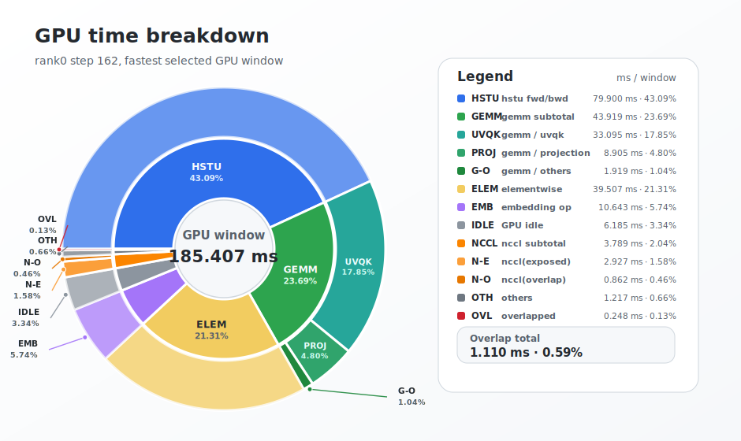

# HSTU end to end performance analysis

This analysis uses one fixed-shape, non-jagged HSTU training run. The run uses Hash-RoundRobin sharding for DynamicEmb tables, DynamicEmb caching, and CUTLASS fused HSTU attention.

```text
exp4_caching_hr:
  --kernel_backend cutlass
  --caching
  --dist_type hash_roundrobin
  --value_dist zipf
  --value_dist_alpha 1.05
```

## Hardware environment

| Field | Value |
|---|---:|
| Cluster scale | 2 DGX nodes, 16 GPUs total |
| GPU model | NVIDIA H100 SXM |
| GPUs per node | 8 |
| Compute dtype | bf16 |
| Single-GPU BF16 dense Tensor Core peak | 989 TFLOPS |
| Image source | Built from the GitHub Dockerfile |

## 1. Spec recap

### 1.1 Experiment configuration

| Field | Value | Notes |
|---|---:|---|
| Experiment | `exp4_caching_hr` | Hash-RoundRobin DynamicEmb caching run |
| Attention backend | `cutlass` | HSTU fused attention kernels |
| DynamicEmb caching | enabled | Host stores full DynamicEmb tables; HBM stores cache slice |
| Sharding plan | row-wise with `hash_roundrobin` | Applies to DynamicEmb tables |
| Key value distribution | Zipf, alpha = 1.05 | Applies to `item` and `user_id` IDs |

### 1.2 Model

| Parameter | Value |
|---|---:|
| Hidden size, `H` | 1024 |
| HSTU layers, `L` | 8 |
| Attention heads, `N` | 4 |
| Head dimension, `D` | 256 |
| Attention projection dim, `N * D` | 1024 |
| UVQK output dim, `4 * N * D` | 4096 |
| Item embedding dim | 128 |
| Contextual embedding dim | 128 |
| Contextual tokens, `C` | 3 |
| Prediction head | `[512, 8] x 8 tasks` |
| Dense parameter size | 81.15 MiB bf16 |
| Optimizer | Adam, lr = 1e-3 |

### 1.3 Dataset and embedding tables

The generated gin is the source of truth. It contains five embedding tables:

| Table | Features | Rows | Dim | Type | Placement in this run | Host memory | HBM/device memory |
|---|---|---:|---:|---|---|---:|---:|
| `item` | `item` | 50M | 128 | DynamicEmb | Host full table, HBM cache ratio `R = 0.1` | 23.84 GiB | 2.38 GiB cache |
| `action` | `action` | 100 | 128 | Static embedding | Device placement follows `data_parallel` sharding | N/A | 50 KiB |
| `user_id` | `user_id` | 50M | 128 | DynamicEmb | Host full table, HBM cache ratio `R = 0.1` | 23.84 GiB | 2.38 GiB cache |
| `user_age` | `user_age` | 100 | 128 | Static embedding | Device placement follows `data_parallel` sharding | N/A | 50 KiB |
| `item_category_l1` | `item_category_l1` | 50 | 128 | Static embedding | Device placement follows `data_parallel` sharding | N/A | 25 KiB |

Embedding table parameters are stored as fp32 for both DynamicEmb tables and TorchRec static tables. Lookup outputs may be cast later to the training dtype; this table counts storage in fp32.

When DynamicEmb caching is enabled, CPU host memory stores the full DynamicEmb tables. Without caching, count host memory as the portion outside the HBM ratio.

### 1.4 Training batch

The item/action feature length is fixed at 2048. HSTU preprocessing interleaves action and item embeddings and prepends contextual embeddings, so `T = 2 * S + C`.

| Parameter | Symbol | Value |
|---|---|---:|
| Batch size per GPU | `B` | 32 |
| Item/action feature sequence length | `S` | 2K |
| Contextual tokens | `C` | 3 |
| HSTU effective sequence length | `T = 2 * S + C` | 4,099 |
| Effective tokens per GPU step | `B * T` | 131,168 |

### 1.5 Embedding lookups per batch

| Lookup group | Per-GPU batch formula | Value per GPU step |
|---|---:|---:|
| Sequence lookups, `item + action` | `2 * B * S` | 131,072 |
| Contextual lookups, `user_id + user_age + item_category_l1` | `3 * B` | 96 |
| All embedding lookups | `2 * B * S + 3 * B` | 131,168 |
| DynamicEmb lookups only, `item + user_id` | `B * S + B` | 65,568 |

### 1.6 Training FLOPs per step (FWD+BWD)

Benchmark constants: `H = 1024`, `L = 8`, `N = 4`, `D = 256`, `S = 2048`, `C = 3`, `T = 4099`, `max_num_candidates = 0`.

| FLOP component | FWD+BWD mathematical expression | Value per GPU step |
|---|---:|---:|
| UVQK GEMMs | `B * L * 3 * 2 * T * H * (4 * N * D)` | 26.41 TFLOPs |
| Projection GEMMs | `B * L * 3 * 2 * T * (N * D) * H` | 6.60 TFLOPs |
| HSTU attention | `B * L * 3.5 * (4 * N * T^2 * D - 2 * N * (T - C)^2 * D)` | 30.88 TFLOPs |
| Small HSTU elementwise/residual approximation | `B * L * (2 * T * N * D + T * N * H)` | 6.45 GFLOPs |
| **Total** | `F_uvqk_step + F_projection_step + F_attn_step + F_misc_step` | 63.89 TFLOPs |

## 2. Performance summary

### 2.1 E2E training summary

E2E throughput comes from a no-NSys, no-eval run with `log_interval = 20`. The GPU timer resets after each log step, so metric logging, FLOP accounting, and loss all-reduce bookkeeping do not leak into the next measured interval. The summary uses 41 steady-state logged intervals, iter 199 through iter 999.

| Metric | Value |
|---|---:|
| Batch size per GPU | 32 |
| HSTU effective sequence length | 4,099 |
| Effective tokens per GPU step | 131,168 |
| Training FLOPs per GPU step | 63.89 TFLOPs |
| Median logged-interval step time | 187.01 ms |
| Median effective tokens/sec/GPU | 701.4K |
| Average effective tokens/sec/GPU | 698.7K |
| Median achieved FLOPS/GPU | 341.6 TFLOPS |
| Median MFU/GPU | 34.54% |
| Average achieved FLOPS/GPU | 340.3 TFLOPS |
| Average MFU/GPU | 34.41% |
| Best logged-interval achieved FLOPS/GPU | 345.0 TFLOPS |
| Best logged-interval MFU/GPU | 34.88% |

### 2.2 GPU time breakdown

Breakdown uses rank0, step 162, the fastest selected GPU window.

| Concept | Definition |
|---|---|
| GPU window | Starts at the first selected GPU kernel and ends at the last selected GPU kernel |
| GPU busy | Union of selected CUDA kernel intervals clipped to the GPU window |
| Exposed operator time | Single-active-kernel segments charged to that kernel's operator category |
| Overlap | Segments with two or more active kernels, split by whether any active kernel is NCCL |
| GPU idle | GPU window time with no active GPU kernel |

Rows are sorted by top-level time contribution; GEMM and NCCL child categories stay adjacent.

| Category | Time / step | % of GPU window |
|---|---:|---:|
| `hstu fwd/bwd` | 79.900 ms | 43.09% |
| `gemm / uvqk` | 33.095 ms | 17.85% |
| `gemm / projection` | 8.905 ms | 4.80% |
| `gemm / others` | 1.919 ms | 1.03% |
| `elementwise` | 39.507 ms | 21.31% |
| `embedding op` | 10.643 ms | 5.74% |
| `GPU idle` | 6.185 ms | 3.34% |
| `nccl(exposed)` | 2.927 ms | 1.58% |
| `nccl(overlap)` | 0.862 ms | 0.46% |
| `others` | 1.217 ms | 0.66% |
| `overlapped` | 0.248 ms | 0.13% |
| **Total GPU window** | 185.407 ms | 100.00% |



Overall overlap is very small in this profiled step: `nccl(overlap)` plus `overlapped` is 1.110 ms, or 0.59% of the GPU window.

### 2.3 HSTU CUTLASS attention TFLOPS and MFU

All 8 HSTU layers use the same fixed non-jagged shape. The table reports aggregate work for one GPU.

| Phase | Shape | FLOPs / GPU | Time | TFLOPS | MFU |
|---|---|---:|---:|---:|---:|
| FWD | `L=8, B=32, T=4099, C=3, N=4, D=256` | 8.82T | 15.718 ms | 561.26 | 56.75% |
| BWD | `L=8, B=32, T=4099, C=3, N=4, D=256` | 22.05T | 65.550 ms | 336.46 | 34.02% |
| FWD+BWD | `L=8, B=32, T=4099, C=3, N=4, D=256` | 30.88T | 81.268 ms | 379.93 | 38.42% |

Phase time is measured on rank0 step 162 for `hstu attn fwd` and `hstu attn bwd`. MFU uses the 989 TFLOPS/GPU bf16 dense peak.

### 2.4 UVQK and projection GEMM TFLOPS and MFU

Let `M = B * T = 131,168`. The 8 HSTU layers share the same GEMM shapes, so the table reports aggregate work for one GPU.

FWD and BWD total time is measured on rank0 step 162 for the corresponding GEMMs.

| Op | Phase | GEMM `M, N, K` | FLOPs / GPU | Time | TFLOPS | MFU |
|---|---|---|---:|---:|---:|---:|
| UVQK | FWD | `131,168, 4,096, 1,024` | 8.80T | 18.729 ms | 469.99 | 47.52% |
| UVQK | BWD total | `131,168, 1,024, 4,096`; `1,024, 4,096, 131,168` | 17.61T | 21.471 ms | 819.95 | 82.91% |
| UVQK | FWD+BWD | aggregate | 26.41T | 40.199 ms | 656.92 | 66.42% |
| Projection | FWD | `131,168, 1,024, 1,024` | 2.20T | 3.111 ms | 707.37 | 71.52% |
| Projection | BWD total | `131,168, 1,024, 1,024`; `1,024, 1,024, 131,168` | 4.40T | 5.794 ms | 759.63 | 76.81% |
| Projection | FWD+BWD | aggregate | 6.60T | 8.905 ms | 741.37 | 74.96% |
| **UVQK + Projection** | FWD+BWD | 8 layers | 33.01T | 49.104 ms | 672.24 | 67.97% |

## 3. Takeaways

- Fused HSTU attention is the largest bucket in the fastest profiled step: 79.900 ms, or 43.09% of the GPU window.
- GEMM is the next largest compute bucket. UVQK accounts for most of that time; projection is smaller.
- NCCL is small in this profile: 2.927 ms exposed plus 0.862 ms overlapped, about 2.04% total.
- GPU idle is 6.185 ms, or 3.34% of the fastest profiled window.
