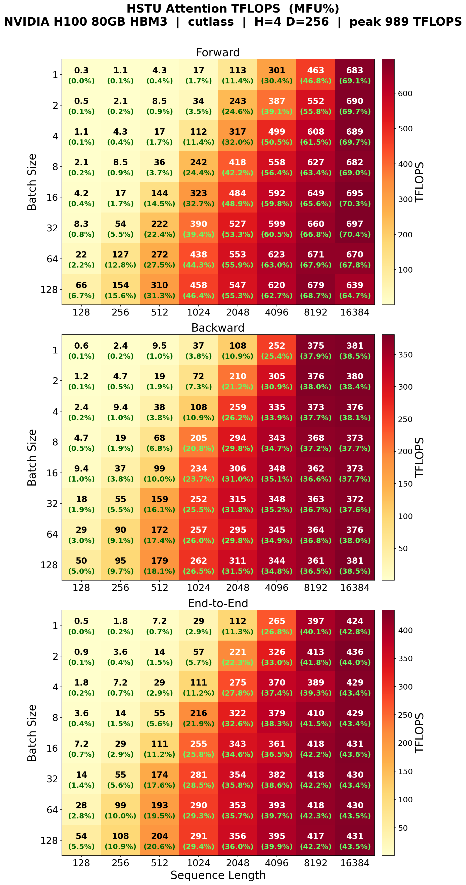

# HSTU Training Benchmark

Three benchmarks are available. They share a single unified
launch/submission pipeline — every script under `scripts/` accepts
`--benchmark-type={e2e,hstu-layer,hstu-attn-kernel}` and dispatches to the
appropriate Python entry.

## Benchmark matrix

| `--benchmark-type` | Python entry | Default experiment list | Shape |
|--------------------|--------------|--------------------------|-------|
| `e2e`              | `training/pretrain_gr_ranking.py` (distributed)     | `experiments.txt`        | Multi-node (default 2×8 GPUs) |
| `hstu-layer`       | `scripts/hstu_layer_benchmark.py`                   | `layer_experiments.txt`  | Single GPU |
| `hstu-attn-kernel` | `scripts/hstu_attn_kernel_benchmark.py`             | `kernel_experiments.txt` | Single GPU |

## Entry points

| Script | Role |
|--------|------|
| `scripts/run_single_experiment_local.sh` | Run **one** config locally (takes `<exp_name> --exp-args=...`) |
| `scripts/run_all_experiments_local.sh`   | Run **all** configs from an experiment list locally |
| `scripts/slurm_job.sub`                  | SLURM job script for **one** config (invoked by submit_all) |
| `scripts/submit_all_experiments_slurm.sh`| Submit **all** configs in an experiment list to SLURM |

Each script accepts `--benchmark-type=<type>` and defaults to `e2e`. All
three user-facing scripts (`run_single_experiment_local.sh`,
`run_all_experiments_local.sh`, `submit_all_experiments_slurm.sh`) support
`--help` and `--dry-run`. `slurm_job.sub` is the internal per-job SLURM
script invoked by `sbatch` — not meant for direct user invocation.

For **SLURM submission**, use `scripts/submit_all_experiments_slurm.sh`
directly; see that script's `--help` for all options.

> **Note**: `--wait-and-analyze` auto-generates `comparison.png` for **e2e
> only** (the analyzer parses the `achieved FLOPS … MFU …%` pattern emitted
> by the training loop). For `hstu-layer` and `hstu-attn-kernel`, the
> per-config logs + artifacts under `results/<ts>/<exp>/` are the source
> of truth; no aggregate plot is generated.

## Experiment list format

All three lists share `exp_name,<args>` per line (comments start with `#`).
`<args>` is benchmark-type-specific:

- `e2e`              : gin options for `generate_gin_config.py`
- `hstu-layer`       : CLI args for `hstu_layer_benchmark.py run`
- `hstu-attn-kernel` : CLI args for `hstu_attn_kernel_benchmark.py`

## Quick commands

```bash
cd recsys-examples/examples/hstu

# E2E: local (single node 8 GPUs)
bash training/benchmark/scripts/run_all_experiments_local.sh \
    --benchmark-type=e2e --exp-file=training/benchmark/experiments.txt

# E2E: SLURM
bash training/benchmark/scripts/submit_all_experiments_slurm.sh \
    --benchmark-type=e2e --container-image=<image> --wait-and-analyze -y

# HSTU layer: local sweep (uses layer_experiments.txt by default)
bash training/benchmark/scripts/run_hstu_layer_benchmark.sh
#   (equivalent to)
bash training/benchmark/scripts/run_all_experiments_local.sh --benchmark-type=hstu-layer

# HSTU layer: SLURM
bash training/benchmark/scripts/submit_all_experiments_slurm.sh \
    --benchmark-type=hstu-layer --container-image=<image> -y

# HSTU attention kernel: local sweep (uses kernel_experiments.txt by default)
bash training/benchmark/scripts/run_hstu_attn_kernel_benchmark.sh

# HSTU attention kernel: SLURM
bash training/benchmark/scripts/submit_all_experiments_slurm.sh \
    --benchmark-type=hstu-attn-kernel --container-image=<image> -y
```

The `run_hstu_layer_benchmark.sh` and `run_hstu_attn_kernel_benchmark.sh`
wrappers are thin shortcuts that delegate to `run_all_experiments_local.sh`
with the right `--benchmark-type`.

## Benchmarks

### End-to-End Training Performance

Progressive benchmark measuring end-to-end MFU as optimizations are incrementally enabled (workload-balanced shuffler, CUTLASS attention, DynamicEmb caching, hash-roundrobin sharding, and prefetch pipeline).

See the [E2E benchmark documentation](./E2E_BENCHMARK.md) for the latest results and the [performance analysis](./PERF_ANALYSIS.md) for the GPU time breakdown.

### HSTU Attention Kernel Benchmark

Standalone benchmark for the **CUTLASS-based HSTU attention kernel**. Sweeps batch sizes and sequence lengths on non-jagged (full-length) inputs and outputs TFLOPS/MFU heatmaps as PNG files.

Configs live in [`kernel_experiments.txt`](./kernel_experiments.txt) — each line is one `(exp_name, CLI args)` pair consumed by the unified launcher.

```bash
cd recsys-examples/examples/hstu

# Local sweep (reads kernel_experiments.txt)
bash training/benchmark/scripts/run_hstu_attn_kernel_benchmark.sh

# SLURM sweep
bash training/benchmark/scripts/submit_all_experiments_slurm.sh \
    --benchmark-type=hstu-attn-kernel --container-image=<image> -y

# Ad-hoc one-off (bypass the config file)
python training/benchmark/scripts/hstu_attn_kernel_benchmark.py \
    --gin-config-file training/configs/benchmark_ranking.gin \
    --batch-sizes 1,2,4,8,16,32,64,128 \
    --seqlens 128,256,512,1024,2048,4096,8192,16384
```

#### Results (single H100-SXM5-80GB)

<p align="center"></p>

MFU uses the dense BF16 Tensor Core peak of 989 TFLOPS per H100 GPU.

| Phase | Best config | Time | TFLOPS | MFU |
|-------|-------------|-----:|-------:|----:|
| Forward | BS=32, SeqLen=16384 | 25.256 ms | 696.6 | 70.4% |
| Backward | BS=128, SeqLen=16384 | 462.121 ms | 380.7 | 38.5% |
| Forward+Backward | BS=2, SeqLen=16384 | 8.834 ms | 435.6 | 44.0% |

The CUTLASS attention kernel reaches peak MFU at large sequence lengths, where the GPU compute units are fully saturated.

### Memory Estimation

CPU-only script that estimates parameter, activation, and optimizer memory. Supports two modes:

```bash
# From gin config (batch_size, max_seq_len, etc. are read from the config)
python ./training/benchmark/scripts/estimate_memory.py \
    --gin_config training/configs/benchmark_ranking.gin

# From command-line arguments (no gin file needed)
python ./training/benchmark/scripts/estimate_memory.py \
    --batch_size 32 --max_seq_len 4096 --hidden_size 1024 --num_layers 8
```
