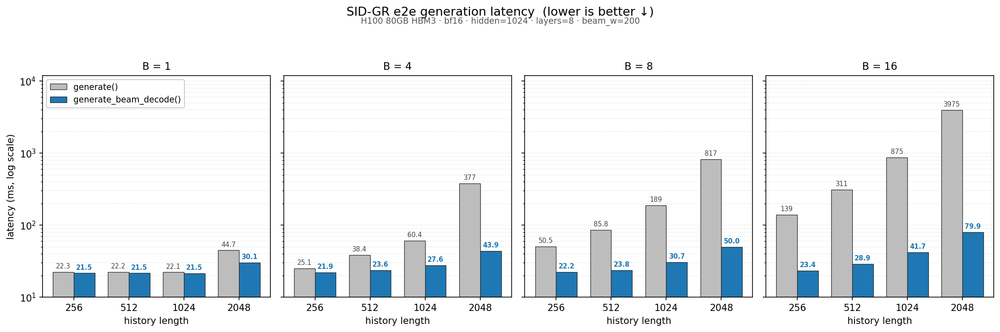

# Benchmark: `generate()` vs `generate_beam_decode()`

**Scope: end-to-end SID-GR generation latency.** Both timed paths run
the full transformer stack (8 layers × { attention + MLP + LayerNorm })
plus the LM head and beam-search bookkeeping — not just the attention
kernel. The `beam_decode_attn` kernel itself (correctness sweep,
per-call kernel latency) lives in the upstream repo
`gitlab-master.nvidia.com:cjerry/gr-decode_atten` (`tests/test_fwd.py`,
`tests/benchmark.py`); we vendor a snapshot at
`corelib/gr_decode_atten/`. The numbers below are the wallclock a real
inference caller sees, including all Python orchestration, embedding
lookup, and per-step KJT overhead.

Hardware: **NVIDIA H100 80GB HBM3 (SXM)**. Container: recsys-examples
Docker (torch 2.11.0a0+nv26.02, CUDA 13.1, bf16). Code: branch
`enh-sid-gr-bench-rerun` (vendored kernel at `corelib/gr_decode_atten/`
pinned to upstream `1c540f6`; `flash-attention` `arbitrary_mask` branch
pinned to `b56db721`). Measured 2026-05-26.

## What the two paths do

- **`generate()`** (baseline): at every hierarchy step, re-runs the
  full transformer over `[history + already-generated SIDs]`. The
  effective batch grows to `B × beam_width` after the first step;
  attention re-attends over the full sequence each step (O(seqlen²)
  per layer).
- **`generate_beam_decode()`** (optimized): one prefill over
  `[history + BOS]` populates a per-layer context KV cache, then
  `num_hierarchies − 1` decode steps each process `B × beam_width`
  new tokens (one beam set per sample) through the transformer, using
  the `beam_decode_attn` kernel to reuse the context KV cache and
  track per-beam ancestry via `topk_indices`.

The savings come from (a) MLP / projections only run on
`B × beam_width` new tokens per step instead of on the full
`[hist + already-generated] × B × beam_width` activations, and (b)
attention complexity drops from O(seqlen²) to O(seqlen × W) per
sample.

## End-to-end latency

Fixed across the grid: `hidden=1024`, `num_heads=8`, `kv_channels=128`
(head_dim), `num_layers=8`, `num_hierarchies=4`, `codebook_size=256`,
`beam_width=200`, `bf16`. Median of 20 iterations after 5 warmup;
`cuda.synchronize()` before/after each iteration. All 16 configs PASS
top-K beam set overlap ≥ 70% between the two paths.

<p align="center">
  
</p>

The wallclock gap between the two bars widens along both axes:

- **Along history length** — `generate()` reruns the full transformer
  over the growing `[history + already-generated]` sequence every
  hierarchy step, so its cost scales super-linearly with history.
  `generate_beam_decode()` pays the history cost once during prefill,
  so it scales much more gently.
- **Along batch** — both paths scale with `B × beam_w` on the
  transformer side (each beam carries its own activations), but
  `generate()` re-runs that activation over the full
  `[hist + already-generated]` sequence at every hierarchy step while
  `generate_beam_decode()` runs it over only the `beam_w` new tokens
  per sample per decode step. The compute saved per sample is roughly
  proportional to history length.

Concretely, the corner cases:

| | `generate()` | `generate_beam_decode()` | speedup |
|---|---:|---:|---:|
| `B=1`, `hist=256`   | 22.3 ms | 21.5 ms | 1.04× |
| `B=1`, `hist=2048`  | 44.7 ms | 30.1 ms | 1.49× |
| `B=16`, `hist=256`  |  139 ms |   23 ms | 5.97× |
| **`B=16`, `hist=2048`** | **3.98 s** | **80 ms** | **49.7×** |

At `B=1` the speedup stays near 1× because per-step Python
orchestration (KJT construction, embedding lookup, layer-stack launch
overhead) dominates wallclock at single-user scale; the optimization
saves prefix recomputation work, which has nowhere to land when there
is little compute to amortize over. The target is batched offline /
warm-pool inference, not single-request online serving.

## How to reproduce

The bar chart above covers `batch ∈ {1, 4, 8, 16}` × `hist ∈ {256,
512, 1024, 2048}`. The benchmark CLI sweeps `hist` and `beam_w` but
not `batch`, so the figure is the concatenation of four runs, one per
batch:

```bash
cd examples/sid_gr
for B in 1 4 8 16; do
  torchrun --nproc_per_node 1 benchmark/benchmark_beam_decode.py \
    --sweep --batch_size $B \
    --num_hierarchies 4 --num_layers 8 \
    --hidden_size 1024 --num_heads 8 --kv_channels 128 \
    --sweep_hist 256,512,1024,2048 \
    --sweep_beam 200 --sweep_dtype bf16
done
```

The Dockerfile adds `corelib/gr_decode_atten/` to `PYTHONPATH`, so no
extra setup is needed inside the container. `--use_jagged_kv` is on
by default; pass `--no-use_jagged_kv` to opt into the dense fallback
for comparison.

## Correctness verification

Three layers, strongest to weakest:

1. **Kernel reference oracle** (upstream `cjerry/gr-decode_atten`,
   `tests/test_fwd.py` — 14 quick cases via `make tt`, 1200
   parametrized cases via `make vt`): per-call kernel output compared
   against a fp32 PyTorch reference. This is the mathematical
   equivalence check for the attention kernel itself.
2. **Mask isolation unit tests** (`TestBeamIsolationMask` in
   `tests/test_beam_decode_generate.py`): direct geometry check on
   `padded_target_aware_causal_mask`.
3. **End-to-end regression guard** (this benchmark + the
   `test_generate_vs_generate_beam_decode_regression_guard` unit
   test): asserts top-K beam SID set overlap ≥ 70% between the two
   paths. bf16 noise plus beam-search topk tie-breaking make
   bit-exact equivalence impossible; the overlap metric stays bounded
   in `[0, 1]` regardless of scale, so the threshold remains
   meaningful as workloads grow.

## Known issues

- **Uniform beam widths across hierarchy steps.** The
  `beam_decode_attn` kernel asserts a fixed stride
  `k_beam.shape[1] == decode_nums × beam_width`, so
  `generate_beam_decode` raises `ValueError` if the configured
  `BeamSearch.beam_widths` list is non-uniform. For retrieval setups
  that taper the beam width over steps, fall back to `generate()`.
- **`beam_width ≤ min(codebook_sizes)`.** `BeamSearch.propagate`
  clamps the per-step topk to
  `min(beam_width, topk_prev × codebook_size_this_step)`. If any
  codebook is smaller than the configured beam width, the clamp
  shrinks topk and breaks the kernel's stride assumption, so
  `generate_beam_decode` also rejects this combination at entry.
  Realistic SID-GR retrieval may want `beam_width = 200 – 1000`;
  ensure every level's codebook is at least that wide.
- **Split-KV + `seqused_k`** hangs the K1 context-attention launch on
  SM90 (observed once during kernel development). The vendored kernel
  forces `num_splits=1` when `seqused_k` is set; the workaround costs
  a few percent on small-batch shapes but avoids the hang.
